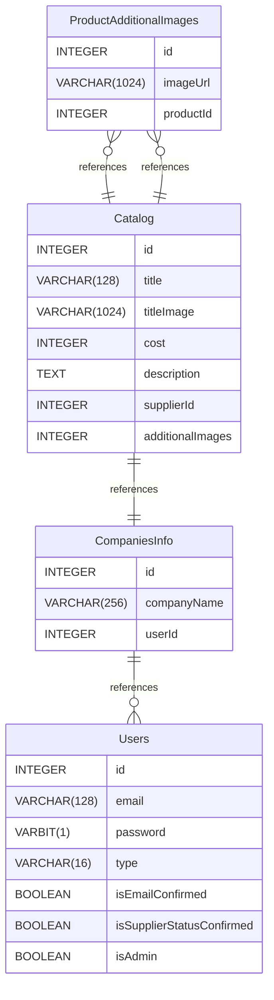

# Flowers Diagram documentation
## Summary

- [Introduction](#introduction)
- [Database Type](#database-type)
- [Table Structure](#table-structure)
	- [Users](#Users)
	- [CompaniesInfo](#CompaniesInfo)
	- [ProductAdditionalImages](#ProductAdditionalImages)
	- [Catalog](#Catalog)
- [Relationships](#relationships)
- [Database Diagram](#database-Diagram)

## Introduction

## Database type

- **Database system:** PostgreSQL
## Table structure

### Users

| Name        | Type          | Settings                      | References                    | Note                           |
|-------------|---------------|-------------------------------|-------------------------------|--------------------------------|
| **id** | INTEGER | 🔑 PK, not null , unique, autoincrement |  | |
| **email** | VARCHAR(128) | not null , unique |  | |
| **password** | VARBIT(1) | not null  |  | |
| **type** | VARCHAR(16) | not null , default: false |  | |
| **isEmailConfirmed** | BOOLEAN | not null , default: false |  | |
| **isSupplierStatusConfirmed** | BOOLEAN | not null , default: false |  | |
| **isAdmin** | BOOLEAN | not null , default: false |  | | 

### CompaniesInfo

| Name        | Type          | Settings                      | References                    | Note                           |
|-------------|---------------|-------------------------------|-------------------------------|--------------------------------|
| **id** | INTEGER | 🔑 PK, not null , unique, autoincrement |  | |
| **companyName** | VARCHAR(256) | not null , unique |  | |
| **userId** | INTEGER | not null  | fk_CompaniesInfo_userId_Users | | 

### ProductAdditionalImages

| Name        | Type          | Settings                      | References                    | Note                           |
|-------------|---------------|-------------------------------|-------------------------------|--------------------------------|
| **id** | INTEGER | 🔑 PK, not null , unique, autoincrement | fk_ProductAdditionalImages_id_Catalog | |
| **imageUrl** | VARCHAR(1024) | not null  |  | |
| **productId** | INTEGER | not null  | fk_ProductAdditionalImages_productId_Catalog | | 

### Catalog

| Name        | Type          | Settings                      | References                    | Note                           |
|-------------|---------------|-------------------------------|-------------------------------|--------------------------------|
| **id** | INTEGER | 🔑 PK, not null , unique, autoincrement |  | |
| **title** | VARCHAR(128) | not null  |  | |
| **titleImage** | VARCHAR(1024) | not null  |  | |
| **cost** | INTEGER | not null  |  | |
| **description** | TEXT | not null  |  | |
| **supplierId** | INTEGER | not null  | fk_Catalog_supplierId_SuppliersInfo | |
| **additionalImages** | INTEGER | not null  |  | | 

## Relationships

- **ProductAdditionalImages to Catalog**: many_to_one
- **Catalog to CompaniesInfo**: one_to_one
- **CompaniesInfo to Users**: one_to_many
- **ProductAdditionalImages to Catalog**: many_to_one

## Database Diagram

