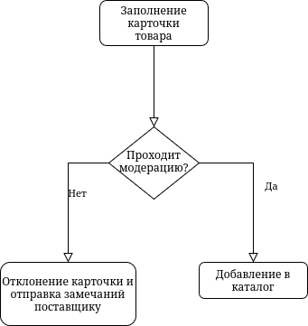
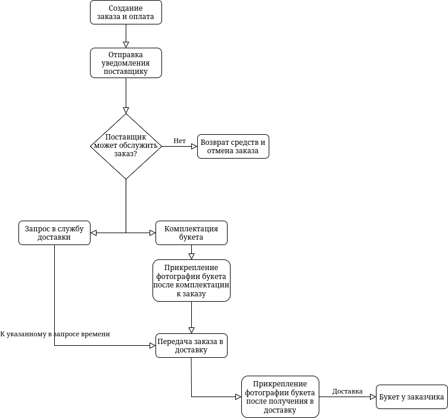
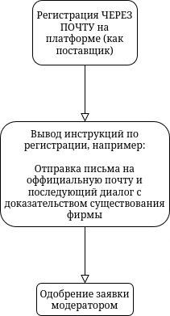

# Директория со юзкейсами

1. 
2. 
3. 

Очевидно, что сценарии эти крайне просты, а в сценарии 'создание новго заказа' требуется добавить информирование заказчика о каждом этапе, возможность отмены заказа на каком-либо этапе и санкции за это, а также случай, когда доставка не может быть завершена успешно (например в квартире не открывают)

Но это БАЗОВЫЕ сценарии, релизация которых необходима для вывода MVP.
